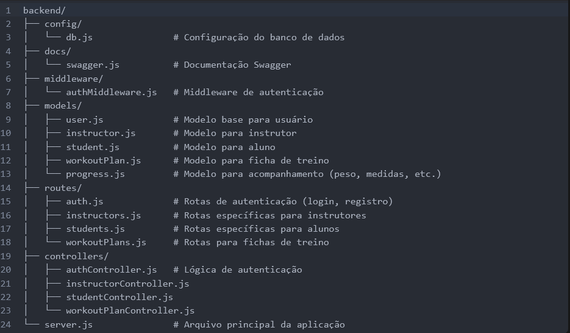

# fitness-back

## Documentação do Projeto

Este é o backend da aplicação **Fitness TCC**, uma API RESTful desenvolvida para gerenciar fichas de treino, alunos e instrutores. O objetivo principal é permitir que instrutores criem e gerenciem fichas de treino para seus alunos, enquanto os alunos possam visualizar suas fichas e acompanhar seu progresso.

---

### **1. Estrutura do Projeto**

A estrutura do projeto foi organizada de forma modular para facilitar a manutenção e escalabilidade. Abaixo está a descrição de cada pasta e arquivo:




---

### **2. Resumo das Funcionalidades**

#### **2.1. Autenticação**
- **Registro**: Usuários podem se registrar como **aluno** ou **instrutor**.
- **Login**: Após o login, um token JWT é gerado para autenticação em rotas protegidas.
- **Rotas**: 
  - `POST /api/auth/register`: Registro de novos usuários.
  - `POST /api/auth/login`: Login de usuários existentes.

#### **2.2. Fichas de Treino**
- **Criação**: Instrutores podem criar fichas de treino independentemente, sem associá-las diretamente a um aluno.
- **Divisões de Treino**: Cada ficha pode ter múltiplas divisões de treino (ex.: Treino A, Treino B).
- **Exercícios**: Cada divisão de treino contém exercícios detalhados (nome, descrição, imagem, séries, repetições, carga ideal).
- **Rotas**:
  - `POST /api/workout-plans`: Criação de uma nova ficha de treino.
  - `GET /api/workout-plans`: Listagem de todas as fichas de treino disponíveis.

#### **2.3. Alunos**
- **Progresso**: Alunos podem ter informações de progresso (peso, altura, medidas corporais) registradas ao longo do tempo.
- **Ficha de Treino**: Uma ficha de treino pode ser atribuída a um aluno específico.
- **Rotas**:
  - `PUT /api/students/:studentId/assign-workout-plan`: Atribui uma ficha de treino a um aluno.

#### **2.4. Instrutores**
- **Gerenciamento**: Instrutores podem criar fichas de treino e atribuí-las a alunos.
- **Especializações**: Informações adicionais sobre certificações e especializações podem ser armazenadas.

---

### **3. Guia de Uso**

#### **3.1. Configuração Inicial**
1. **Instalação de Dependências**:
   Execute o comando abaixo para instalar todas as dependências necessárias:
   ```bash
   npm install
   ```

   Configuração do Banco de Dados : 

    Certifique-se de ter o MongoDB instalado e rodando localmente ou use uma conexão remota.
    Configure a URI do MongoDB no arquivo .env:
    ```env
        MONGO_URI=mongodb://localhost:27017/fitness-tcc
        JWT_SECRET=seu_segredo_jwt
    ```
     
     

Iniciar o Servidor :
Execute o comando abaixo para iniciar o servidor: 

```bash
node server.js
```

O servidor estará disponível em http://localhost:3000. 

Documentação Swagger :
Acesse a documentação interativa da API em: 

    http://localhost:3000/api-docs
     
     
     

#### **3.2. Como Encontrar Determinadas Coisas**

    Modelos de Dados : 
        Todos os modelos estão na pasta models/. Por exemplo, o modelo de ficha de treino está em models/workoutPlan.js.
         

    Rotas da API : 
        As rotas estão definidas na pasta routes/. Por exemplo, as rotas de autenticação estão em routes/auth.js.
         

    Lógica de Negócios : 
        A lógica de negócios está implementada nos controladores, localizados na pasta controllers/. Por exemplo, a lógica para criar uma ficha de treino está em controllers/workoutPlanController.js.
         

    Autenticação : 
        O middleware de autenticação está em middleware/authMiddleware.js.
        O token JWT é gerado após o login e deve ser incluído no cabeçalho das requisições protegidas:
        json
         

        Authorization: Bearer <token>

    Documentação Swagger : 
        Os comentários para documentação Swagger estão diretamente nas rotas (routes/). Eles são processados pelo arquivo docs/swagger.js.
         
     

#### **4. Exemplo de Fluxo de Uso**
4.1. **Registro de Usuário**

Envie uma requisição POST para /api/auth/register com os seguintes dados: 
    
        {
        "name": "João",
        "email": "joao@example.com",
        "password": "senha123",
        "role": "aluno"
        }

Após o registro, faça login enviando uma requisição POST para /api/auth/login: 
json
 
 
{
  "email": "joao@example.com",
  "password": "senha123"
}
 
 

Receba o token JWT na resposta: 

    {
      "token": "eyJhbGciOiJIUzI1NiIsInR5cCI6IkpXVCJ9..."
    }
     
     
     

4.2. **Criação de Ficha de Treino**

Envie uma requisição POST para /api/workout-plans com os seguintes dados: 

        {
        "name": "Ficha de Hipertrofia",
        "divisions": [
            {
            "name": "Treino A",
            "exercises": [
                {
                "name": "Supino Reto",
                "description": "Execução com barra reta.",
                "image": "https://example.com/supino-reto.jpg",
                "sets": 4,
                "reps": 10,
                "idealWeight": 50
                }
            ]
            }
        ]
        }
 
 

Receba a confirmação da criação da ficha: 

    {
      "message": "Ficha de treino criada com sucesso!"
    }
     
     
     

4.3. **Atribuição de Ficha de Treino a Aluno**

Envie uma requisição PUT para /api/students/:studentId/assign-workout-plan com o ID da ficha de treino: 

    {
    "workoutPlanId": "650b8f2e4d8f2e4d8f2e4d8f"
    }
 
 

Receba a confirmação da atribuição: 

    {
      "message": "Ficha de treino atribuída com sucesso!"
    }
     
     
     

#### 5. **Considerações Finais**

Este backend foi projetado para ser modular, escalável e fácil de manter. Ele fornece uma base sólida para o desenvolvimento de funcionalidades adicionais, como gráficos de progresso, relatórios personalizados e integração com o frontend. 

Se precisar de mais informações ou ajustes, consulte a documentação Swagger ou entre em contato com o desenvolvedor responsáve